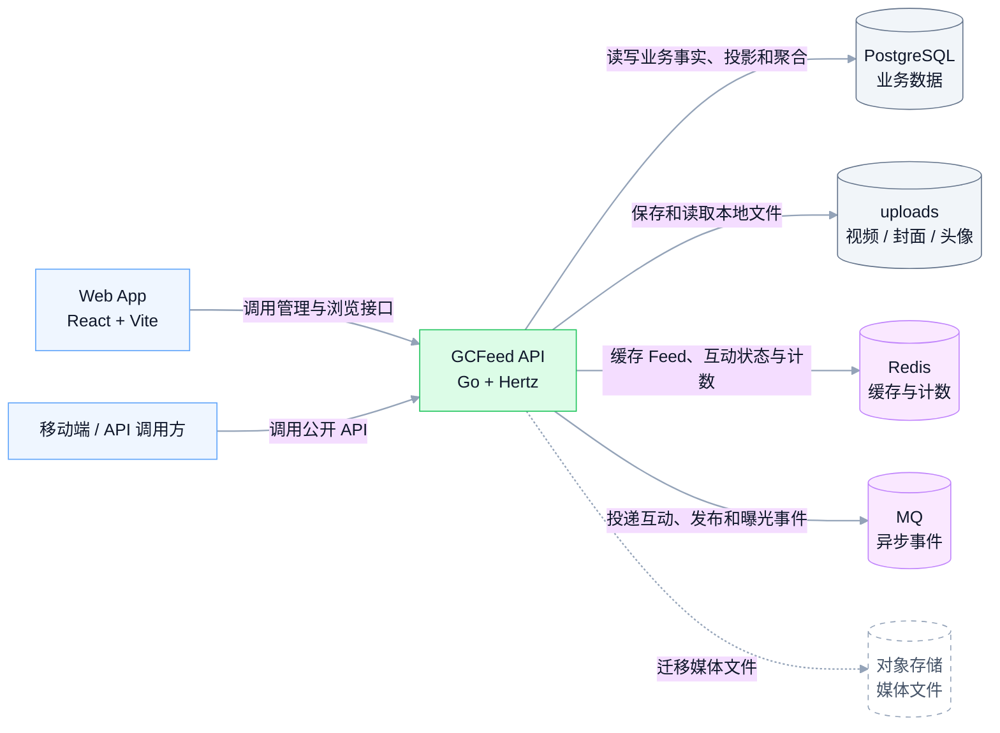
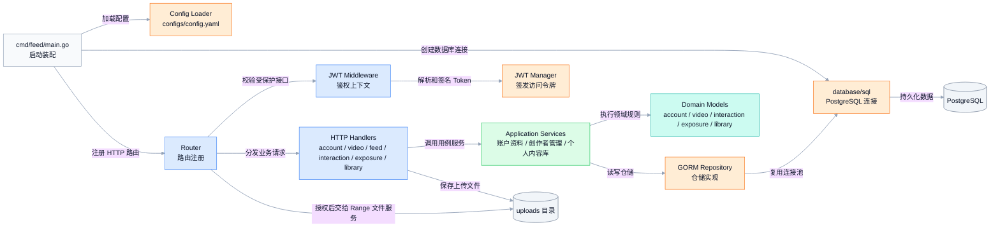
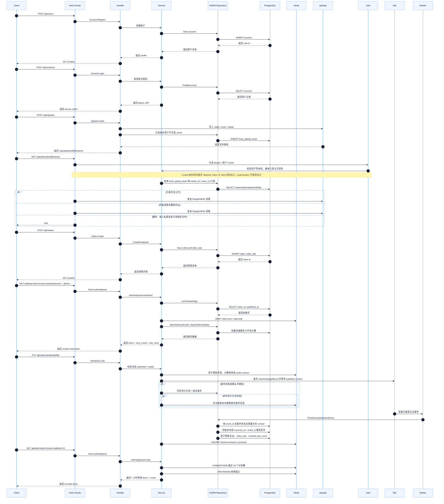
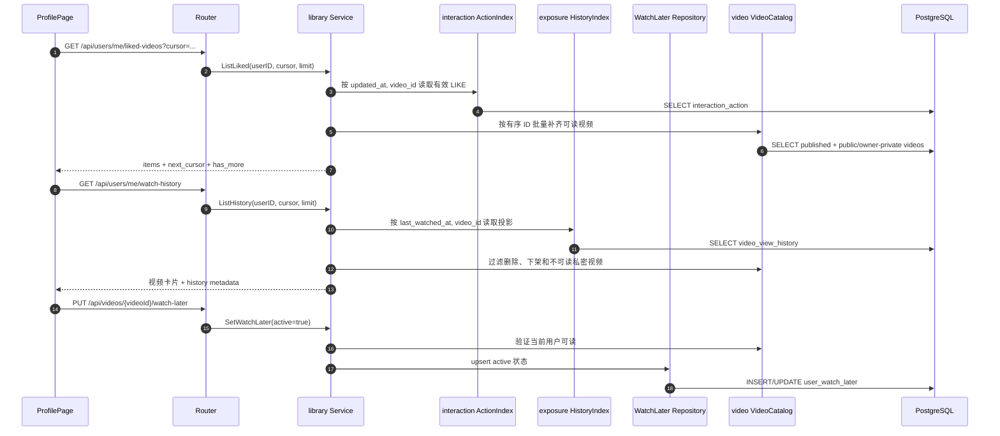
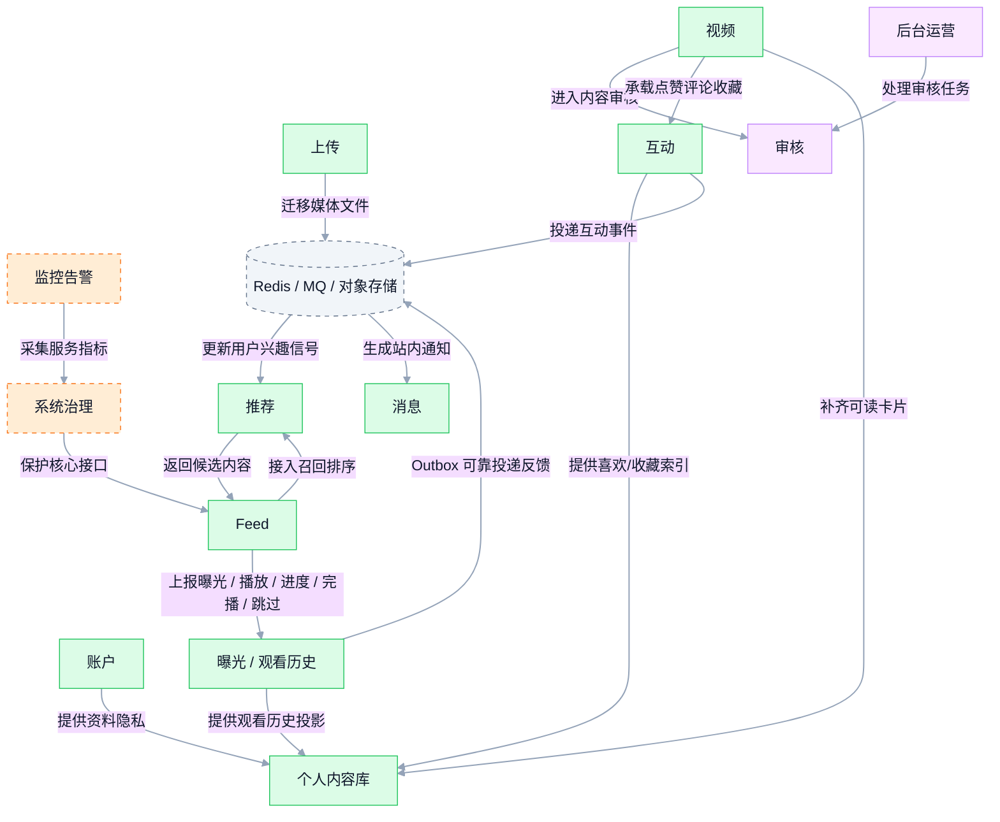

# 视频 Feed 系统架构图（MVP）

本文按 `mermaid-diagrams` skill 重构：每张图只表达一个概念，节点保持克制，连接线带语义标签，图前给出用途说明。当前实现由 Go API 与 Worker 共同承载账户、视频、Feed、互动、曝光、个人内容库和消息能力。

## 1. 系统上下文

这张图展示 GCFeed 与客户端、存储和演进型基础设施的边界。

## 2. API 内部分层

这张图展示 Go API 单体内部的主要代码层次和依赖方向。

## 3. 核心请求链路

这张图展示从注册、登录、上传、发布到刷 Feed 的 MVP 主链路。

### 3.1 个人主页内容链路

这张图展示个人主页如何保持领域所有权，并在 `library` Application Service 中聚合喜欢、收藏、观看历史和稍后再看。

跨模块能力通过 `interfaces/http/router/library_adapters.go` 适配 Domain 窄接口；HTTP Handler 不直接组合多个仓储。

## 4. 数据模型

这张图聚焦个人主页扩展涉及的实际 GORM 模型及所有权关系。统一迁移还注册 Feed Inbox、消息、关系、播放配置和嵌入等既有模型。

迁移在 PostgreSQL advisory transaction lock 内执行 `AutoMigrate`，包括异步互动回执 `version` 和行为行 `latest_event_version`/兼容顺序列，随后补齐 `video_stat`、将历史视频可见性置为 `public`、补齐隐私默认行、以版本 `0` 和现有行为 `updated_at` 安全回填旧行为顺序、重建 `user_content_stat`、仅在 `app_migration` 缺少持久标记时从原始观看事件一次性回填 `video_view_history`，最后确保 Feed Timeline 索引。标记与回填处于同一事务，用户之后删除或清空的历史不会被后续 API/Worker 启动恢复。

## 5. 演进能力地图

这张图展示已落地闭环和后续模块的连接方式，虚线代表规划中的能力边界。

## 6. 说明

- 当前代码以 Go API 承载同步 HTTP，用 Worker 消费互动、发布、曝光预热和嵌入事件；内部按接口层、应用层、领域层、基础设施层组织。
- 对外接口统一挂载在 `/api/*`；`/uploads/*` 中头像/普通文件公开读取，视频/封面按不可变上传所有权、同作者视频引用、数据库状态和可选 Authorization 或“HttpOnly JWT 资产 Cookie + Web 活跃标记”授权后提供 Range/HEAD；资产 Cookie 只在登录时写入，离线退出也会同步移除活跃标记；健康检查使用 `/health`。
- 数据持久化使用 PostgreSQL；API 和 Worker 通过 advisory transaction lock 串行执行完整 GORM 自动迁移。内容统计校正采用快照差量叠加，既修复旧偏差也保留其他在线实例已提交的并发增量；观看历史聚合修复只修正仍存在的投影，不会从原始事件恢复用户已删除的历史。
- Feed 通过 `scene` 分发策略：`timeline` 按 `published_at DESC, id DESC` 排序，`hot` 按最近 60 分钟互动热度排序，并通过 Base64 游标分页。
- 公开读取统一要求视频已发布且公开；Feed 缓存命中后仍通过数据库批量验证公开可读性，避免旧缓存泄露私密内容。
- Web 为每次激活视频建立播放会话，按 10 秒边界和暂停、seek、切换、隐藏、退出上报曝光、播放、进度、完播和跳过。观看事实按 `(user_id, event_id)` 幂等，历史投影按有界 `(occurred_at, event_id)` 单调更新；事实、历史/曝光投影和 `view_event_outbox` 同事务提交，Worker 通过租约、重试与 publisher confirm 将反馈可靠送入推荐链路。
- 新互动请求只接受当前已发布公开视频；Redis 在状态/计数事务内为每个行为事实分配单调版本。RabbitMQ 使用 publisher confirm；失败或确认不确定时同步落库，双失败时只条件回滚仍由该版本拥有的 Redis 状态，相同幂等重试会重发原事件。Redis 提交后若计数读取失败，应用使用脱离请求取消且有超时的上下文条件回滚；回滚报错时重新确认投递原事件并以同步回执持久化兜底，并发更高版本不会被旧请求覆盖。事件回执按 `event_id` 去重，行为行优先按 `version` 拒绝延迟旧事件，同版本才用 `(occurred_at, event_id)` 兼容定序；重复和旧事件成功确认且不改变统计。缺失/删除视频和无效载荷终止消费而不无限重入队，所有内容读取仍按当前可见性过滤。
- 个人主页本人能力包括作品、推荐、喜欢、收藏、观看历史、稍后再看；公开主页仅含公开作品、公开合集和隐私允许的喜欢。“短剧”和“我的预约”没有领域模型或接口，明确不在架构范围内。
