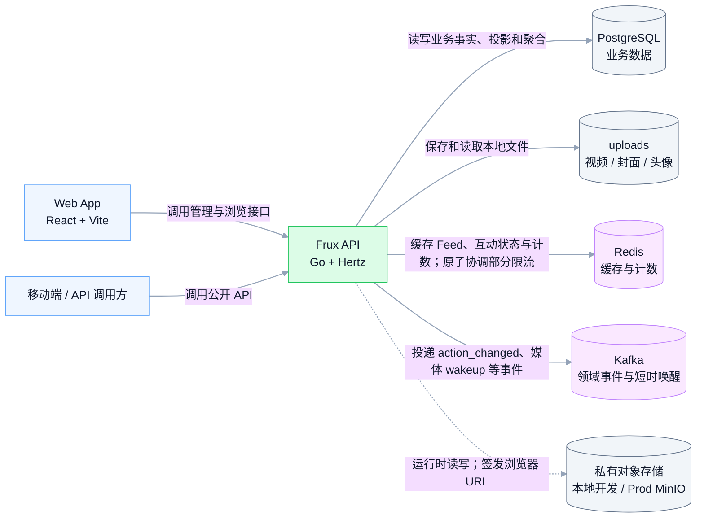
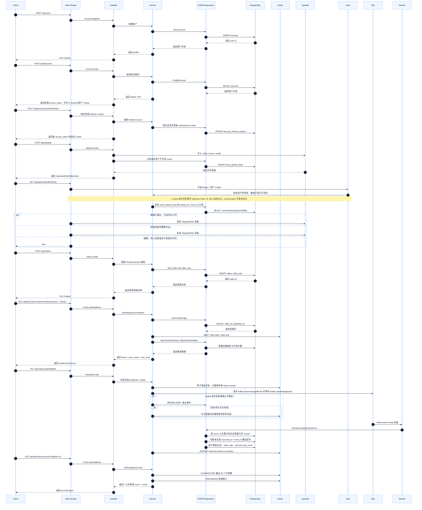
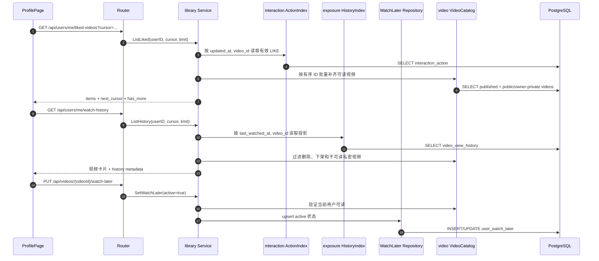
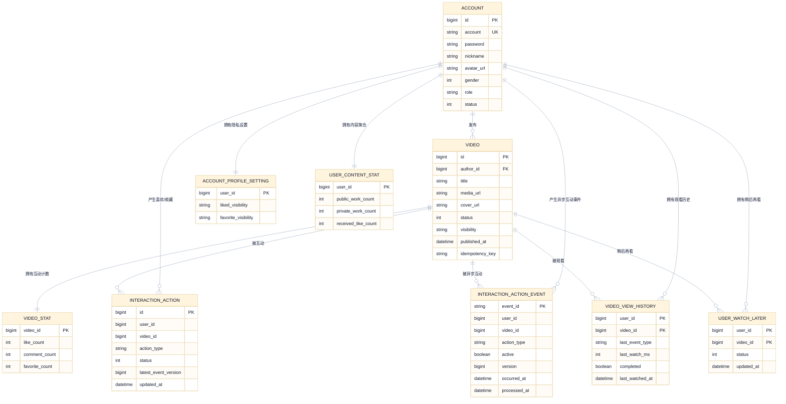
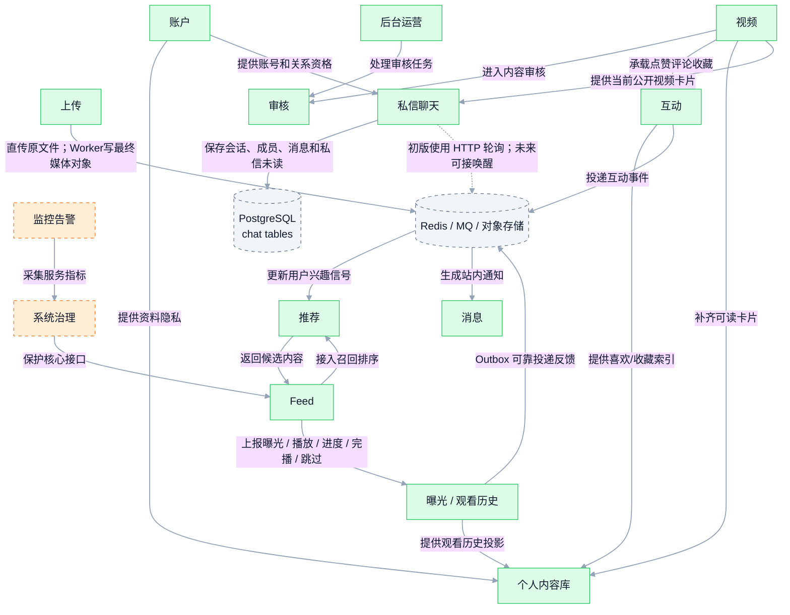
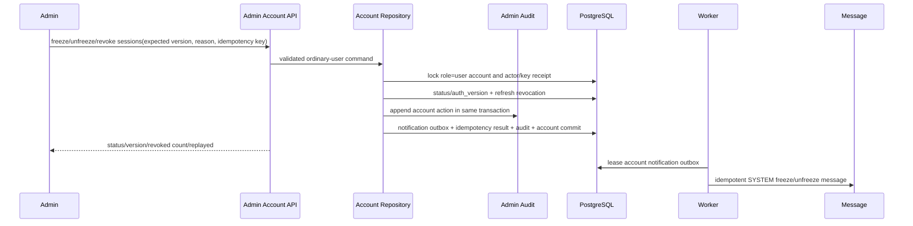
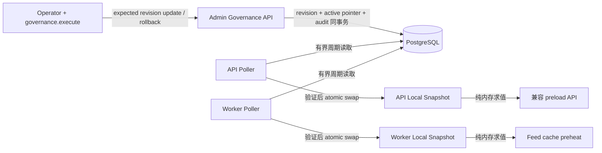
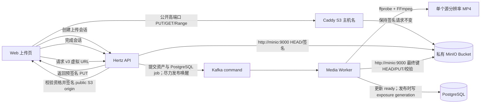
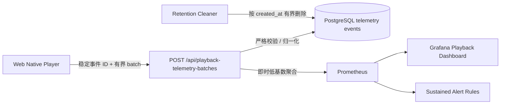

# 视频 Feed 系统架构图（MVP）

本文按 `mermaid-diagrams` skill 重构：每张图只表达一个概念，节点保持克制，连接线带语义标签，图前给出用途说明。当前实现由 Go API 与 Worker 共同承载账户、视频、Feed、互动、曝光、个人内容库、事件通知和私信聊天能力。

## 1. 系统上下文

这张图展示 Frux 与客户端、存储和演进型基础设施的边界。



NAT 主机 Prod 将对象存储分成两个端点：API/Worker 通过 Compose 网络访问
`http://minio:9000`，浏览器使用 `https://FRUX_S3_DOMAIN:<public-port>` 的预签名 URL。主机
systemd Caddy 在本地 443 根据 `FRUX_DOMAIN` 和 `FRUX_S3_DOMAIN` 分流；公网分配的 HTTPS 高端口
只由 NAT 转发到本地 443。MinIO Bucket 保持私有，Console 只绑定回环地址并通过 SSH 隧道访问。

## 2. API 内部分层

这张图展示 Go API 单体内部的主要代码层次和依赖方向。

```mermaid
---
config:
  theme: base
  layout: dagre
  themeVariables:
    background: transparent
    fontFamily: Inter, PingFang SC, Microsoft YaHei, Arial
    primaryTextColor: "#0F172A"
    lineColor: "#94A3B8"
    clusterBkg: "#F8FAFC"
    clusterBorder: "#CBD5E1"
---
flowchart LR
  %% Internal layering in apps/api
  classDef entry fill:#F8FAFC,stroke:#94A3B8,color:#0F172A,stroke-width:1px;
  classDef http fill:#DBEAFE,stroke:#3B82F6,color:#0F172A,stroke-width:1px;
  classDef service fill:#DCFCE7,stroke:#22C55E,color:#0F172A,stroke-width:1px;
  classDef domain fill:#CCFBF1,stroke:#14B8A6,color:#0F172A,stroke-width:1px;
  classDef infra fill:#FFEDD5,stroke:#F97316,color:#0F172A,stroke-width:1px;
  classDef store fill:#F1F5F9,stroke:#64748B,color:#0F172A,stroke-width:1px;

  Entry["cmd/feed/main.go<br/>启动装配"]
  Router["Router<br/>路由注册"]
  Auth["JWT Middleware<br/>身份上下文"]
  AdminAuth["Admin Permission Middleware<br/>当前账号状态与角色"]
  Audit["Admin Audit<br/>不可变操作事实"]
  Handlers["HTTP Handlers<br/>account / video / feed / interaction / exposure / library / message / chat"]
  Services["Application Services<br/>账户资料 / 创作者管理 / 个人内容库 / 通知 / 私信"]
  Domains["Domain Models<br/>account / video / interaction / exposure / library / message / chat"]
  Config["Config Loader<br/>configs/config.yaml"]
  JWT["JWT Manager<br/>隔离 key ring / 短期访问令牌"]
  Session["Refresh Session<br/>旋转 / 撤销 / auth_version"]
  Repo["GORM Repository<br/>仓储实现"]
  SQL["database/sql<br/>PostgreSQL 连接"]
  PostgreSQL[("PostgreSQL")]
  Uploads[("uploads 目录")]

  Entry -->|"加载配置"| Config
  Entry -->|"创建数据库连接"| SQL
  Entry -->|"注册 HTTP 路由"| Router
  Router -->|"校验受保护接口"| Auth
  Auth -->|"解析和签名 Token"| JWT
  Services -->|"登录、刷新、登出、改密"| Session
  Session -->|"哈希凭证与会话状态"| Repo
  Auth -->|"/api/admin 当前身份"| AdminAuth
  AdminAuth -->|"读取当前主体"| Repo
  AdminAuth -->|"最佳努力记录拒绝"| Audit
  AdminAuth -->|"权限通过"| Handlers
  Router -->|"分发普通业务请求"| Handlers
  Handlers -->|"调用用例服务"| Services
  Services -->|"执行领域规则"| Domains
  Services -->|"读写仓储"| Repo
  Services -->|"构建成功审计事实"| Audit
  Audit -->|"与受保护变更同事务追加"| Repo
  Repo -->|"复用连接池"| SQL
  SQL -->|"持久化数据"| PostgreSQL
  Handlers -->|"保存上传文件"| Uploads
  Router -->|"授权后交给 Range 文件服务"| Uploads

  class Entry entry;
  class Router,Auth,AdminAuth,Handlers http;
  class Services,Audit service;
  class Domains domain;
  class Config,JWT,Repo,SQL infra;
  class PostgreSQL,Uploads store;
  linkStyle default stroke:#94A3B8,stroke-width:1.4px
```



请求限流是 Router 组合的横切边界：JWT middleware 先建立 server-derived user identity，
随后 registered rate-limit middleware 执行 bounded local bucket；只有声明为 distributed 的
group 才通过 infrastructure adapter 执行单次 Redis Lua。Redis 失败按 policy 使用更严格
local fallback 或 fail closed，Handler 不拥有私有限流器。

消费端认证使用 5 分钟默认、最多 15 分钟的内存 Access JWT，以及 PostgreSQL 中只保存 Secret
SHA-256 的 30 天 Refresh Session。Refresh Cookie 限定 `/api/sessions`、HttpOnly、
SameSite=Strict；每次刷新旋转 Secret。改密事务递增 `account.auth_version`、撤销全部旧 Refresh
Session 并为当前设备建立替换会话。普通旧 Access 最多存活到短 TTL；后台权限读取本来就逐请求查询
当前账号，因此同时比较 `auth_version` 并立即拒绝改密前的 Admin Token。

Kafka 是唯一事件流基础。代码注册 Topic、Partition Key、
Producer 和 Consumer Group；franz-go Producer 使用 idempotence + `acks=all`，Consumer 禁用自动
提交并在耐久结果后提交 Offset。`action_changed` 与 `view_event_recorded` 已接入独立 Topic、
active Group。视频首次公开事实通过
`video_publication_event_outbox -> frux.video.published.v1`，Feed 与 embedding 各自维护 Offset；
embedding Group 先保证 `hash-ngram-v1`，再在启用时将完整多模态合同/source hash handoff 到
PostgreSQL leased Job，随后即可提交 Offset；媒体准备和 Provider 推理由独立 Worker 完成。权威
`multimodal_vector_fact` 与可重建 `multimodal_projection` 分离，数据库执行 Exact Cosine，未创建
HNSW/IVFFlat。API/Worker 通过双向 HMAC 的 `frux-multimodal-v1` HTTP Adapter 连接外部推理运行时，
启用前校验 capability 与完整合同；具体模型和部署语言不进入 Domain/Application。媒体仍由 PostgreSQL
job 决定正确性，Kafka command 只负责唤醒。

Kafka 故障恢复也是独立 sibling surface：实时事件 Consumer 可在有界本地重试后进入固定 delay
Topic 和 Group 专属不可变 DLQ；API 只允许按注册 Topic/Partition/Offset 脱敏读取。Replay 在
PostgreSQL 中按 actor/idempotency fingerprint 与坐标跨事务串行，先提交 pending claim，再在事务外
保持 key/value 不变发布到 owning Group 第一 retry Topic，并在 acknowledgement 后用第二事务提交
replay result 与 `kafka_dead_letter.replay` audit。Producer 结果可能已确认或 finalize 失败时保留
pending/unknown；同 key 重复请求只验证注册目标 retention 内的稳定 Replay ID evidence，找到后
finalize，不存在且完整扫描可证明时记录失败，malformed 或不可用 evidence 继续 pending，禁止重复发布。
DLQ Record 保留到 retention；旧 Queue head/Ack 接口已经退役。
媒体和未来语义长任务仍以 PostgreSQL job 为恢复边界。

## 3. 核心请求链路

这张图展示从注册、登录、上传、发布到刷 Feed 的 MVP 主链路。



### 3.1 个人主页内容链路

这张图展示个人主页如何保持领域所有权，并在 `library` Application Service 中聚合喜欢、收藏、观看历史和稍后再看。



跨模块能力通过 `interfaces/http/router/library_adapters.go` 适配 Domain 窄接口；HTTP Handler 不直接组合多个仓储。

## 4. 数据模型

### 4.1 上下文推荐链路

推荐 Feed 的 `context` 经 HTTP 有界归一化后进入 Recommendation Service。服务并发调用
fresh、hot、内容相似、followed-author、session-continuation Provider，按策略 budget/deadline
合并并重新验证可见性；失败 Provider 只标记 degraded。策略和画像存于 PostgreSQL，
Redis 仅保存短期有序 snapshot，带签名的 cursor 绑定用户、scene、request ID 和 policy version。

观看/互动/关系的耐久事实分别通过 View Event、Action 和 Follow Outbox 投影为画像；投影延迟
不会阻塞原接口。采样 `recommendation_request_log` 保存有界请求和候选解释，`recommendation_outcome`
以 request ID 关联曝光、播放、进度、完播、跳过和反馈，供离线评估。Redis、embedding 或单个
Provider 不可用时保留当前可用召回或 deterministic cursor，不将外部优化组件作为 HTTP 事实提交条件。

这张图聚焦个人主页扩展涉及的实际 GORM 模型及所有权关系。统一迁移还注册 Feed Inbox、消息、关系、播放配置和嵌入等既有模型。



迁移在 PostgreSQL advisory transaction lock 内执行 `AutoMigrate`，包括异步互动回执 `version` 和行为行 `latest_event_version`/兼容顺序列，随后补齐 `video_stat`、将历史视频可见性置为 `public`、补齐隐私默认行、以版本 `0` 和现有行为 `updated_at` 安全回填旧行为顺序、重建 `user_content_stat`、仅在 `app_migration` 缺少持久标记时从原始观看事件一次性回填 `video_view_history`，最后确保 Feed Timeline 索引。`chat_conversation`、`chat_conversation_member` 和 `chat_message` 也在同一个 advisory-lock migration 中注册，并显式创建 pair、成员、幂等、历史和 unread 索引；不修改或回填 `user_message`。标记与回填处于同一事务，用户之后删除或清空的历史不会被后续 API/Worker 启动恢复。

### 4.2 私信数据模型与提交边界

私信把用户对会话、成员状态和消息事实拆成三张 PostgreSQL 表。`chat_conversation` 用 `(lower_user_id, higher_user_id)` 唯一约束保证一个用户对只有一个会话；空会话没有 `last_message_id`，不会进入普通列表。`chat_conversation_member` 恰好为每个会话保存两行，维护 `last_read_message_id`、`last_read_at` 和 `unread_count`；`chat_message` 使用全局递增 ID 作为顺序，保存 `TEXT` 或 `VIDEO`、规范化文本或 `video_id`、发送者幂等键，以及未来撤回用的保留字段。

发送事务按确定性的用户 ID 顺序锁定会话成员，比较发送者和幂等键的既有 payload；Application Service 在任何可变账号、互关、成员或视频授权检查前先解析已提交消息，因此不确定响应的精确重试不会因后续取关、冻结或视频下架而被错误拒绝。成功时同时插入消息、更新会话最后消息并只增加接收成员 unread。重复请求返回原消息，不再次增加 unread；任一步骤失败则整体回滚。Kafka、Redis 和消息通知 Outbox 不在私信发送提交路径中。

私信 Application Service 通过 Router composition root 的窄 adapter 读取正常账号显示资料、单查询互关关系和当前公开视频卡片。服务每次创建/发送都检查当前互关；取关只阻断后续发送，不删除历史。视频只存 ID，读取时批量 hydration，当前不可读视频返回无保护字段的 unavailable tombstone。

私信列表和历史使用绑定排序元组的版本化 URL-safe cursor：会话按 `(last_message_id DESC, id DESC)`，历史按 `message_id DESC`，互关收件人按 `(followed_at DESC, user_id DESC)`；历史响应除消息页外始终带当前 conversation 快照和 eligibility（包括空会话），活动会话使用 `after_message_id` 增量读取。通知 `user_message` 的事实、API 和深链保持独立。

## 5. 演进能力地图

这张图展示已落地闭环和后续模块的连接方式，虚线代表规划中的能力边界。



### 5.1 自动审核链路

```mermaid
sequenceDiagram
  participant Media as Media Worker / legacy create
  participant Review as Review Service
  participant DB as PostgreSQL
  participant Producer as Moderation Producer
  participant Delivery as Media Publication

  Media->>Review: ready pending video
  Review->>DB: lock video + create-or-get (video_id, review_version)
  Producer->>Review: internal-token bounded machine result
  Review->>DB: lock result identity, case, video
  Review->>DB: insert immutable signals + decision
  alt reject
    Review->>DB: close case + reject video atomically
  else human
    Review->>DB: pending_human; video remains pending
  else approve
    Review->>DB: close case + publish lifecycle atomically
    Review->>Delivery: promote ready media / publish event
  end
```

机器结果与供应商实现解耦；策略版本和证据 provenance 保存在 PostgreSQL。未知 label 保留但
保守进入人审。媒体 ready 事件重复安全，Worker reconciliation 会补建 ready pending 视频的遗漏案件。

### 5.2 人工复审链路

```mermaid
sequenceDiagram
  participant Reviewer
  participant API as Admin Review API
  participant DB as PostgreSQL
  participant Audit as Admin Audit
  participant Worker as Review Notification Worker
  participant Message

  Reviewer->>API: GET signed priority/age queue
  API->>DB: stable page including DB-time expired leases
  Reviewer->>API: claim(expected case version)
  API->>DB: lock case; store reviewer + token hash + DB-time expiry
  API-->>Reviewer: opaque lease token
  Reviewer->>API: decision(token, case/review version, idempotency key)
  API->>DB: lock idempotency, case, video
  API->>Audit: append validated success fact in same transaction
  API->>DB: decision + case + video + audit + notification outbox
  DB-->>API: atomic commit
  Worker->>DB: lease review notification outbox
  Worker->>Message: idempotent SYSTEM message
```

队列固定按 `priority DESC, created_at ASC, id ASC`，签名 cursor 绑定过滤器；查询直接纳入按
数据库时间过期的租约。pending-human priority 由触发信号确定性映射为 `1..100` 并与路由原子
提交。claim、renew、release 和 decision 都使用 case version；相关行锁先于数据库时间采样。
决定要求当前 holder、匹配 video review version、注册 reason 和 payload-bound idempotency；
旧版本决定重放不再触发媒体/发布副作用。审计失败整体回滚；通知失败只重试 durable Outbox。

内容运营接口继续由视频领域拥有，而不是建立通用 Admin Repository。`GET /api/admin/videos`
使用签名 cursor 绑定全部筛选并按 `created_at DESC, id DESC` 查询；下架/恢复锁定 video 行并校验
独立运营 version，在同一事务提交生命周期、内容统计、不可变处罚记录、成功 audit 和缓存失效
及媒体收敛意图。Video Worker 使用有界批次、`FOR UPDATE SKIP LOCKED`、租约和指数退避处理该
意图：先失效 Redis，再按当前数据库状态保护或发布媒体，全部成功后才标记 delivered；失败保留
有界错误并重试。按当前状态收敛也避免旧恢复意图在后续再次下架后错误公开内容。

普通账号管理继续由 account 领域拥有，而不是放入通用 Admin Repository：



列表和详情只查询当前 `role=user`，因此 Reviewer、Operator、Admin 或未知角色即使通过直接 ID 也按
普通用户不存在处理。冻结、解冻和强制退出都递增 `auth_version`；冻结与强制退出撤销全部活动
Refresh Session，解冻不恢复旧会话。消费端 Access JWT 不逐请求查询数据库，所以旧 Access 只在
原短 TTL 内可能继续有效，并可读取已投递的冻结消息。冻结/解冻 Outbox 耐久保存注册原因，旧 Token
错过后仍可在解冻并重新登录时读取。密码登录只在正确密码校验后返回
`AUTH_ACCOUNT_FROZEN`，未知账号、错误密码和注销账号保持通用失败。账号处置不改变视频生命周期，
内容下架仍使用独立视频运营事务。

### 5.3 运行时降级控制链路



revision 不可变，active pointer 使用 expected revision 和按 key advisory lock 串行更新；成功
审计与 pointer 切换原子提交。API/Worker poll failure 保留 last-known-good，超过注册 key 的
max staleness 后使用 failure default。请求和消费热路径不访问控制面。

## 6. 说明

- 当前代码以 Go API 承载同步 HTTP，用 Worker 消费互动、发布、曝光预热、嵌入和媒体处理事件；内部按接口层、应用层、领域层、基础设施层组织。
- `message` 与 `chat` 是两个不同的体验域：`message` 保留事件通知和 `user_message` 兼容合同，`chat` 以 PostgreSQL 三表承载互关 1:1 用户内容。`/api/inbox-stats/unread` 只做 additive 汇总，导航使用 total，两个视图仍保留独立 unread。
- 私信首版没有 WebSocket/SSE。Web 在消息工作区可见时立即轮询会话和活动历史，随后每 5 秒刷新，瞬时失败按 10/20/30 秒有界退避，页面隐藏、路由离开或账号变化时暂停；发送和已读成功后立即本地 reconcile。Redis、Kafka 和对象存储不是接受私信的前置依赖。
- 私信分享和嵌套播放窗口共享焦点栈；Escape 只关闭当前最上层 dialog，关闭后焦点返回触发控件，避免一次按键越级关闭外层播放。
- 私信发送使用认证用户维度的 `chat_send` 分层限流；正常 profile 本地 30、分布式 60，紧急 profile 本地 10、分布式 20，分布式协调失败时 fail-closed。观测只保留 operation、kind、outcome、error class 和 latency 等低基数维度，不记录正文或身份内容。
- 对外接口统一挂载在 `/api/*`；`/uploads/*` 中头像/普通文件公开读取，视频/封面按不可变上传所有权、同作者视频引用、数据库状态和可选 Authorization 或“短期 HttpOnly JWT 资产 Cookie + Web 活跃标记”授权后提供 Range/HEAD；资产 Cookie 在登录、刷新和改密时随 Access JWT 轮换，普通响应不刷新，离线退出同步移除活跃标记；健康检查使用 `/health`。
- 数据持久化使用 PostgreSQL；API 和 Worker 通过 advisory transaction lock 串行执行完整 GORM 自动迁移。内容统计校正采用快照差量叠加，既修复旧偏差也保留其他在线实例已提交的并发增量；观看历史聚合修复只修正仍存在的投影，不会从原始事件恢复用户已删除的历史。
- Feed 通过 `scene` 分发策略：`timeline` 按 `published_at DESC, id DESC` 排序，`hot` 按最近 60 分钟互动热度排序，并通过 Base64 游标分页。
- Web 预加载直接消费活动 Feed 的有序 items，并按网络、save-data、内存和 `buffer_ms` 保留有界上一条/当前条/后续媒体资源；场景、请求、身份或源版本变化会取消旧代际。`/api/preload-videos` 仅保留为按发布时间补充资源的兼容接口。
- 新视频默认进入待审核且没有 `published_at`。批准和媒体基线就绪是独立门：只有 `status=published`、`visibility=public` 且媒体为 `legacy_ready/ready` 时才公开；Feed 缓存命中后仍通过数据库批量验证，避免旧缓存泄露待审、拒绝、私密或处理中内容。
- Web 为每次激活视频建立播放会话，按 10 秒边界和暂停、seek、切换、隐藏、退出上报曝光、播放、进度、完播和跳过。观看事实按 `(user_id, event_id)` 幂等，历史投影按有界 `(occurred_at, event_id)` 单调更新；事实、历史/曝光投影和 `view_event_outbox` 同事务提交，Worker 通过租约、重试与 publisher confirm 将反馈可靠送入推荐链路。
- 新互动请求只接受当前已发布公开视频；Redis 在状态/计数事务内为每个行为事实分配单调版本。Kafka 发布等待 broker acknowledgement；失败或不确定时同步落库，发布与 fallback 双失败时只条件回滚仍由该版本拥有的 Redis 状态，相同幂等重试会重发原事件。Redis 提交后若计数读取失败，应用使用脱离请求取消且有超时的上下文条件回滚；回滚报错时重新确认投递原事件并以同步回执持久化兜底，并发更高版本不会被旧请求覆盖。事件回执按 `event_id` 去重，行为行优先按 `version` 拒绝延迟旧事件，同版本才用 `(occurred_at, event_id)` 兼容定序；重复和旧事件成功确认且不改变统计。缺失/删除视频和无效载荷终止消费并进入注册恢复策略，所有内容读取仍按当前可见性过滤。
- 个人主页本人能力包括作品、推荐、喜欢、收藏、观看历史、稍后再看；公开主页仅含公开作品和隐私允许的喜欢。“短剧”、合集和“我的预约”没有当前产品入口。
- 播放技术遥测与观看行为事实分流：Web 将渲染首帧、播放结果、rebuffer/seek、选源、帧质量和终止错误组成有界版本化批次；API 严格校验并原子写入 `playback_telemetry_batch/event`，立即聚合低基数 Prometheus 指标。批次失败不影响播放，旧 QoS 端点在迁移窗口内继续兼容。
- 人工审核使用数据库时间租约和 optimistic case/review version；最终决定、视频生命周期、成功审计和作者通知 Outbox 原子提交，Review Worker 再通过 message Application 幂等生成站内通知。
- Web Admin Shell 复用 typed History router 和 SessionProvider，`AdminApp` 通过动态 import 形成独立 JS/CSS chunk；客户端权限只过滤导航，直接 URL 和所有动作仍由后台中间件授权。`/admin/accounts` 只在服务端确认 `account.manage` 后展示，并明确冻结不等于内容下架、旧 Access 最多残留到短期到期。
- 运行时降级控制只接受代码注册 typed key；API 与 Worker 轮询 PostgreSQL 后原子替换本地
  snapshot。当前 `feed.preload.enabled` 仅影响兼容 preload 与非关键 cache preheat；poll
  failure 使用 last-known-good，过度陈旧使用 failure default，不能关闭 fanout 或耐久事实。

## 7. 生产媒体交付



视频运营通过受保护的 media admin Application 读取任务概览和终态历史，使用批量 video catalog 补充
标题与作者。Worker 将当前步骤和节流后的步骤进度写入 PostgreSQL；后台重新处理先提交任务重置、
幂等回执和审计，再由耐久 Outbox 驱动视频侧状态改为处理中。

- 本地开发继续支持 `/api/uploads` 和受保护 `/uploads/*`；生产模式通过 `media.backend=s3` 使用上传会话。
- Prod 运行时 S3 endpoint 为 `http://minio:9000`，浏览器 presign endpoint 为
  `https://FRUX_S3_DOMAIN:<public-port>`；保持 path-style、私有 Bucket 和精确应用 Origin CORS。
- Caddy 的 S3 路由不得改写 Host、path、query、method 或 Range，MinIO Console 不进入公开路由。
- `media_asset` 保存原始资产，`media_variant` 为新任务保存单个源分辨率基线，并继续兼容历史清晰度、
  manifest 和 segment；`media_processing_job` 使用版本、租约和尝试次数保证重复消息安全。
- 转码输出的 asset metadata、variants、cleanup/job 最终 transition 在一个 PostgreSQL 事务内先验证
  claim token 与未过期 lease；只有 fenced commit 成功后才允许媒体公开投影和生命周期通知。
- `frux.media.processing-requested.v1` Consumer 只校验 job 并有界 signal 后提交，不在转码期间持有
  Offset；轮询与 reconciliation 覆盖命令丢失、重复、延迟、满容量和重启。
- `frux.video.published.v1` 保留 30 天首次发布事实。Feed 与 `hash-ngram-v1` 使用独立 Group，
  各自在幂等副作用或条件向量持久化成功后提交 Offset。
- Worker 对本地输出计算 SHA-256，按确定性最终键执行 HEAD/reuse 或一次 PUT 后校验；封面直接引用已校验上传键。基线先就绪时仅更新 `media_status=ready` 并保持公共 URL 为空；批准先发生时也等待基线，双门满足后才投影 URL 和发送发布事件。
- Worker 和 FFmpeg 仍是媒体状态机的必需执行边界；H.264/AAC 可以 stream copy，但不能通过部署配置
  禁用 FFmpeg 或把原始上传直接标记为 ready。
- 新公共变体使用不暴露存储键的 `media/v3/{generation}/{variant_id}/{filename}` 虚拟 URL。发布、下架和恢复只原子更新 `public/exposure_generation`，不复制正文；恢复生成新 generation。公开 resolver 校验 variant generation 与视频当前公开资格后签名原 protected key。
- Frux 307 使用 25 分钟可重验证缓存，签名对象响应使用 30 分钟可重验证缓存，并保留 ETag、Range/HEAD。下架立即拒绝新签名，已缓存或已签发访问最多延迟 30 分钟失效。历史 `media/v2/*` 先验证或修复 protected counterpart，旧对象保留至少 30 分钟后清理。
- 私密、删除、拒绝和下架事务与 `media_video_lifecycle_task` 原子提交。媒体 worker 通过租约、重试和
  any-status 视频状态执行保护；stale private intent 在视频重新公开后终结为 superseded。删除视频
  立即停止 API 发现，随后由 durable lifecycle task 调用 `media_cleanup_task` 延迟删除对象；
  Reconciler 修复过期租约、缺失对象、不完整变体和孤儿对象。

## 8. 播放观测链路



首帧优先使用渲染回调，卡顿排除暂停和 seek。数据库保留诊断标识，指标标签只允许固定技术维度；看板和告警无法按用户、视频、请求或播放会话展开。
