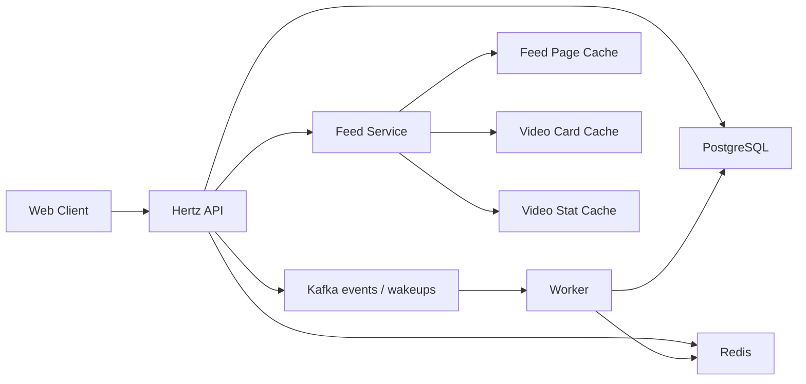

# Frux 性能与稳定性优化

本文沉淀 Feed 核心链路的性能问题、优化策略和验收指标。架构总览见 [architecture.md](architecture.md)，代码规范见 [engineering.md](engineering.md)。

## 1. 优先级边界

| 优先级 | 目标 | 典型问题 |
| --- | --- | --- |
| P0 | 保证首发可用 | Timeline 高访问、Feed 组装慢、游标重复、互动并发、缓存一致性 |
| P1 | 提升体验 | Hot 热 key、发布放大、预加载、播放 QoS |
| P2 | 支持扩展 | 多机部署、服务拆分、推荐特征、监控告警闭环 |

## 2. 核心架构



Redis 用于读性能和短期状态，Kafka 保留 action/view 与视频首次发布事件，并承载非权威媒体唤醒；
PostgreSQL 保存最终事实、Outbox 和长耗时 durable jobs。

推荐召回还使用每服务 16 个有限 provider slots：不响应取消的下游调用保持占位，后续请求降级而非继续创建 goroutine。

推荐候选池不再按响应页大小提前截断。普通 Policy 要求所选 Provider budget 总和不超过500，并让完整可读
唯一池进入统一评分；需要扩大召回宽度时，Policy 显式配置50–500的 pre-rank pool、Provider 顺序和 reservation。
运行时先在 Provider 内稳定去重和截断，再对完整有界并集做一次可见性查询，最后执行 reservation-first 与
固定顺序 round-robin fill。这样可把400+400等宽召回压缩为确定的500条 Ranker 输入，又不比较不同 Provider
的 score 标尺，也不让并发完成速度决定优先级。重点容量指标是 visibility superset、selected pool、merge
duration、Provider underfill/exhausted 和 overlap；预算扩张必须同时验证数据库批量可见性查询与 Ranker P95。

## 3. P0 优化清单

| 编号 | 问题 | 策略 | 验收指标 |
| --- | --- | --- | --- |
| P0-01 | Timeline 首页大量访问 | 页缓存、短 TTL、singleflight 回源 | 首页 P95 响应稳定在可接受范围 |
| P0-02 | Feed 卡片组装慢 | 页缓存只存 ID，卡片和计数批量 MGET | 单页查询减少 N+1 回源 |
| P0-03 | 分页重复和漏数 | 游标携带排序字段，稳定排序 | 翻页结果无重复且顺序稳定 |
| P0-04 | 数据库缓存一致性偏差 | 写事实表，缓存短 TTL，异步更新 | 计数最终一致，缓存异常可回源 |
| P0-05 | 并发点赞收藏评论 | Redis 快速状态、Kafka retained stream、PostgreSQL fallback、稳定事件 ID | 重复请求计数稳定 |
| P0-06 | 大 V 发布放大 | 粉丝数阈值、异步 fanout、懒加载补偿 | 发布接口不被粉丝量线性拖慢 |
| P0-07 | 热门视频热 key | 分钟桶 ZSET、窗口合并、短期窗口缓存 | Hot 查询避免集中打 PostgreSQL |

## 4. Timeline 访问

问题：Timeline 首页访问频率高，直接查询 PostgreSQL 会把压力集中到 `video` 和 `video_stat`。

优化：

- `feed:page:v1:timeline:limit:{limit}:first` 保存首页排序结果。
- `feed:page:v1:timeline:limit:{limit}:cursor:{cursorHash}` 保存后续页。
- 页缓存只保存 `video_id` 和排序字段。
- Feed Service 通过批量 MGET 读取 `video:card` 和 `video:stat`。
- 回源时使用 singleflight 合并同 key 请求。

推荐 TTL：

| 缓存 | TTL |
| --- | --- |
| 首页页缓存 | 5 秒 + 抖动 |
| 后续页缓存 | 45 秒 + 抖动 |
| 视频卡片 | 15 分钟 |
| 视频计数 | 15 秒 |

## 5. Feed 卡片组装

问题：Feed 返回项需要视频主体、作者信息和计数，逐条查询会形成 N+1。

优化：

1. 页查询得到视频 ID 列表。
2. Redis 批量读取视频卡片和计数。
3. 缺失项批量回源 PostgreSQL。
4. 回源结果写回 Redis。
5. 按原始排序组装响应。

验收：

- 单页 Feed 查询使用批量读取。
- Redis 缺失时最多一次批量视频查询和一次批量计数查询。
- 返回顺序与页缓存或数据库排序一致。

## 6. 游标分页

问题：只用 offset 翻页时，新视频插入会导致重复或漏数。

优化：

| 场景 | 排序 | 游标字段 |
| --- | --- | --- |
| Timeline | `published_at DESC, id DESC` | `published_at`、`video_id` |
| Hot | `hot_score DESC, video_id DESC` | `window_end`、`offset` |
| 评论 | `created_at DESC, id DESC` | `created_at`、`comment_id` |

验收：

- 同一排序字段下使用 ID 作为稳定次级排序。
- 游标解析失败返回 400。
- 多页查询结果无重复。

## 7. 缓存一致性

原则：

- PostgreSQL 保存最终事实。
- Redis 保存短期状态、热榜和读缓存。
- 写路径优先保证事实安全。
- 读路径允许短 TTL 偏差。

互动写入：

```text
HTTP Handler
  -> Interaction Service
  -> Redis 行为状态和实时计数
  -> Kafka ActionChangedEvent
  -> Worker
  -> PostgreSQL interaction_action / interaction_comment / video_stat
```

异常处理：

| 异常 | 处理 |
| --- | --- |
| Redis 不可用 | 降级为 PostgreSQL 路径或返回可识别错误 |
| Kafka 投递失败/确认不确定 | 同步 PostgreSQL receipt/outbox fallback；发布与 fallback 双失败条件回滚 Redis |
| View Kafka 发布失败 | Outbox 保留 pending 并重试；稳定 event ID 吸收重复 |
| Worker 重复消费 | 使用唯一键和幂等键保证安全 |
| 缓存计数偏差 | TTL 过期后回源修正 |

## 8. 发布放大

问题：作者发布视频后，如果同步写入所有粉丝 inbox，发布耗时会随粉丝数线性增长。

优化：

- 小粉丝量作者可同步写入关注流 inbox。
- 大粉丝量作者走独立 Kafka Feed Group 的 fanout worker；发布 Outbox 与粉丝规模解耦。
- 粉丝数超过阈值时按批次写 Redis inbox。
- 关注新作者时可回填作者近期视频。
- Redis inbox 保留固定长度，避免无限增长。

验收：

- 发布接口响应时间与粉丝数解耦。
- Worker 可重复消费同一发布事件。
- Feed 与 hash embedding lag 隔离。媒体 command 在本地容量满时仍快速提交，由轮询恢复，避免
  ffmpeg 时长影响 Group liveness。
- inbox 长度受控。

## 9. Hot Feed

Hot Feed 使用 Redis ZSET 维护一小时滑动窗口。

| 行为 | 分数 |
| --- | --- |
| 点赞 | +3 |
| 收藏 | +4 |
| 评论 | +5 |
| 取消点赞 | -3 |
| 取消收藏 | -4 |
| 删除评论 | -5 |

Key：

```text
feed:hot:minute:v1:{yyyyMMddHHmm}
feed:hot:window:v1:{windowEndUnix}
```

读取时合并最近 60 个分钟桶，移除分数小于等于 0 的条目，再按分数倒序分页。

## 10. 监控指标

建议指标：

| 指标 | 说明 |
| --- | --- |
| `feed_request_p95_ms` | Feed 请求 P95 |
| `feed_cache_hit_ratio` | Feed 页缓存命中率 |
| `video_card_cache_hit_ratio` | 视频卡片缓存命中率 |
| `interaction_queue_lag` | 互动队列积压 |
| `interaction_worker_error_count` | Worker 错误数 |
| `postgres_query_p95_ms` | PostgreSQL 查询 P95 |
| `redis_error_count` | Redis 错误数 |
| `frux_kafka_produce_total{result}` | Kafka 投递结果 |

## 11. 落地顺序

1. 先确保游标分页和批量组装稳定。
2. 再接入 Feed 页缓存、卡片缓存和计数缓存。
3. 再完成互动异步落库与 Worker 幂等。
4. 再补发布 fanout 和 Hot 窗口缓存。
5. 最后补监控指标和降级开关。

## 12. 生产媒体交付

- Web 经 `https://FRUX_S3_DOMAIN:<public-port>` 直接上传私有 MinIO，避免大文件经过 API 进程；
  完成接口只执行有界元数据校验和任务持久化。API/Worker 运行时使用 `http://minio:9000`，不绕行
  NAT 和 Caddy。
- Worker 只生成一个源分辨率 H.264/AAC faststart MP4；兼容 H.264/AAC 源使用 stream copy，
  不再为新任务生成 480p/720p/1080p rendition 或 DASH bundle。
- stream copy 不等于跳过处理；Worker、ffprobe 和 FFmpeg 仍是 durable job 的必需部分。
- 单机 Prod 保持一个媒体 slot，使用启动时验证的 180 分钟源时长、360 分钟单命令预算和 `veryfast`
  preset；不要用增加并发掩盖单条命令预算不足。
- 处理输出按资产、处理版本和校验和直接写入一个受保护最终键；匹配对象复用，冲突不覆盖。封面直接
  引用已校验上传键，消除输出临时对象回读和封面重复 GET/PUT。
- 公开发布使用数据库 exposure generation 和 v3 虚拟 URL，发布、下架、恢复不复制对象正文。307
  缓存 25 分钟，签名媒体响应缓存 30 分钟；历史 v2 对象验证/修复 protected counterpart 后延迟清理。
- `media_url` 保留基线兼容，`playback_sources` 增量返回多源，避免旧客户端同步升级。
- Caddy 只做 S3 反向代理且不改写 Host、path、query、method 或 Range；MinIO 保持私有、path-style
  和精确高端口 Origin CORS，Console 不公开。
- 重点指标为对象操作耗时、`frux_media_object_outbound_bytes_total{source}`、处理成功/失败、输出
  数量、过期租约、孤儿对象和清理积压；标签不得包含用户、视频、资产、URL 或对象键。

## 13. Feed 顺序预加载

- 候选直接来自活动 Feed 的有序 items，避免推荐、热门和关注场景被全局发布时间顺序污染。
- 默认网络最多准备立即后续 2 条，WiFi/5G 最多 4 条，慢网只准备下一条元数据，离线或 save-data 不主动加载视频字节。
- 控制器保留上一条、当前条和前向窗口，使用 `buffer_ms`、buffered range 与 `canplay` 判定就绪，并通过源版本、重试冷却和 LRU 控制失效与内存。
- Feed 接近页尾时提前走原分页，不调用兼容 `/api/preload-videos` 创建第二排序模型。
- 页面提供无用户、视频或请求标签的 attempts、ready、reuse、cancellation、failure 和活动资源调试状态。

## 14. 播放遥测成本控制

- Web 只保留当前页面会话的内存队列，每批最多 50 个事件和 64 KiB，最多排队 4 个批次。
- flush 发生在大小阈值、10 秒间隔、终止状态、页面隐藏和退出；失败仅做有界重试并复用原 batch/event ID。
- API 认证用户默认每分钟最多提交 60 个批次，仓储入口再次限制事件数，单事务批量写入并按事件 ID 去重。
- 原始事件默认保留 168 小时，清理每小时最多删除 1000 条事件和无事件批次，配置上限为 10000。
- Prometheus 只聚合 scene/network/player/method/error/outcome/quality/source 等固定维度，禁止用户、视频、请求、会话和 URL 标签。

## 15. 自适应播放器成本控制

- 主 MP4 路径只加载约 330 KiB 的主 JS（gzip 约 100 KiB）；dash.js 保持约 854 KiB 的独立懒加载 chunk，不进入基线启动路径。
- Feed 只保留 previous/current/next 三个 player slot；高频时间和缓冲变化局限在 adapter 订阅，不重建整页。
- constrained network/save-data 优先低码率或兼容 MP4，MediaCapabilities 不可用时回退到 `canPlayType`。
- `buffer_ms` 同时作为 next-slot ready 门槛和切入后 buffering 依据，避免“已预加载”但实际不可播的虚假状态。

## 16. 上下文推荐容量与降级

- 每个 Provider 有独立 deadline 和最多 100 条 bootstrap budget；当前五个 Provider 的预算总和为500。
  Policy 路径会让全部可读唯一候选进入统一评分，不按响应页大小或发布时间提前截断；预算总和超过500的
  策略在 Quota Merge 可用前被拒绝。Snapshot 和日志候选仍不超过500。Provider 超时只降低该请求，
  不能等待全局最长任务。
- Redis snapshot 默认 TTL 为 300 秒，每用户最多保留 20 个活动 session；snapshot miss、读写错误
  使用 signed cursor 中的确定性 fallback，不重算已返回页。
- 请求日志稳定采样 1%，默认保留 30 天；清理使用 `created_at` 索引分批执行。日志只保留
  归一化 context、候选 ID/reason/分量和 degraded 标志。
- 运行前可执行：
  `cd apps/api && go test ./internal/application/recommendation -run '^$' -bench '^BenchmarkRecommendBoundedPool$' -benchtime=5s`。
  该基准以最大500候选有界池运行并发 `RunParallel`，用于比较提交前的 allocation 与 ns/op，不能替代
  含 PostgreSQL/Redis 的容量压测。

## 17. 私信性能与容量边界

私信首版优先保证事实一致性而不是最低延迟：

- PostgreSQL 是会话、成员、消息、最后消息摘要和 unread 的权威存储；发送事务不等待 Kafka、Redis 或 WebSocket。
- 会话列表使用 `(last_message_id DESC, id DESC)`，历史使用 `(conversation_id, id DESC)`，幂等使用 `(sender_id, idempotency_key)` 唯一索引；空会话不进入普通列表。
- Application 按页批量 hydration 对方资料和公开视频卡片，历史中的重复 video ID 只读取一次。不可用视频返回无 URL 的 tombstone，不能用缓存旧卡片绕过当前可见性。
- Web 只在可见消息工作区轮询：启用或恢复可见时立即刷新，成功后间隔 5 秒，瞬时失败退避到 10/20/30 秒；页面隐藏、路由离开或账号变化会清理 timer。活动会话只用 `after_message_id` 拉增量，避免重复下载完整历史；初始和增量响应都携带会话/资格元数据。
- 发送成功和已读成功立即更新本地会话/徽标，轮询只负责收敛其他端的提交。失败保留已加载内容并显示 degraded 状态，不用刷新清空工作区。
- 收件人查询使用互关关系表的一次 SQL 和昵称过滤，不让客户端加载两套关系列表再求交集；cursor 绑定过滤 query，防止分页重复和无界扫描。
- `chat_send` 按用户限流，正常为本地 30、分布式 60，紧急为本地 10、分布式 20；分布式协调不可用时 fail-closed。指标只保留低基数 operation/kind/outcome/error-class。
- 当前不新增 chat Redis cache、Kafka topic 或 WebSocket runtime。若未来轮询成本证明需要唤醒，只能将 Redis/Kafka 作为 committed row 的 hint，客户端仍通过 HTTP 读取 PostgreSQL 权威数据。
